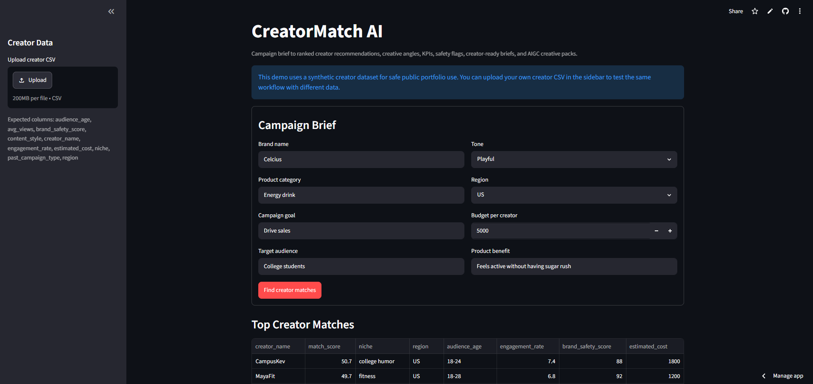
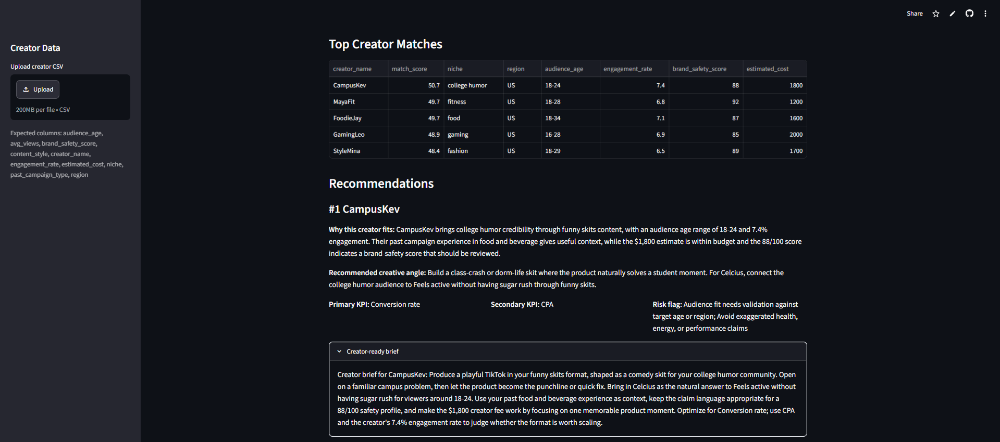
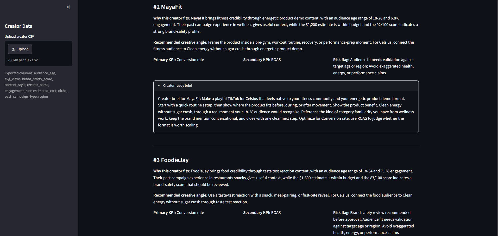

# CreatorMatch AI

**Live Demo:** https://creator-match-ai.streamlit.app

CreatorMatch AI is a Streamlit product prototype that turns an advertiser campaign brief into ranked creator recommendations. It shows how creator discovery can become more explainable, brand-safe, and action-oriented by combining structured scoring with creator-ready strategy outputs.

The app is designed as a portfolio project for TikTok Creative Product Manager and AI Product Manager roles, with a focus on advertiser workflows, creator-marketplace matching, and AI-assisted creative planning.

## Problem

Advertisers need to move quickly from a campaign brief to the right creators, but creator selection can be subjective and hard to explain. Teams often need to compare niche fit, audience fit, engagement, brand safety, and budget at the same time.

## Solution

CreatorMatch AI provides a lightweight decision-support workflow. Users enter a campaign brief, review ranked creator matches, and get recommendation details including fit rationale, creative angle, KPI suggestions, risk flags, and a creator-ready brief.

## Key Features

- Campaign brief form for brand, category, goal, audience, tone, region, budget, and product benefit
- Top-5 ranked creator recommendations
- Explainable weighted match score
- Personalized creative angles by creator niche and content style
- KPI suggestions based on campaign goal and creator format
- Brand-safety, budget, audience, and claims-related risk flags
- Creator-ready briefs for outreach or campaign planning
- Optional creator CSV uploader for custom datasets

## Synthetic Data

The included `data/creators.csv` dataset is synthetic so the project can be shared publicly without exposing private creator, advertiser, campaign, or performance data.

Users can upload their own creator CSV in the app sidebar to test the same workflow with different creator data.

## Scoring Logic

CreatorMatch AI calculates a weighted match score:

- Niche fit: 30%
- Audience fit: 25%
- Engagement rate: 20%
- Brand safety score: 15%
- Budget fit: 10%

Niche fit compares the campaign category, goal, and product benefit against the creator niche, content style, and past campaign type. Audience fit considers age and region. Engagement is normalized within the dataset, brand safety uses the creator safety score, and budget fit rewards creators whose estimated cost fits the campaign budget.

## Screenshots

### Campaign Brief Input



### Ranked Creator Results



### Creator-Ready Brief



## Tech Stack

- Python
- Streamlit
- Pandas
- Synthetic CSV creator dataset
- Rule-based recommendation logic

## How to Run Locally

1. Install dependencies:

   ```bash
   pip install -r requirements.txt
   ```

2. Start the app:

   ```bash
   streamlit run app.py
   ```

3. Open the local Streamlit URL shown in your terminal.
